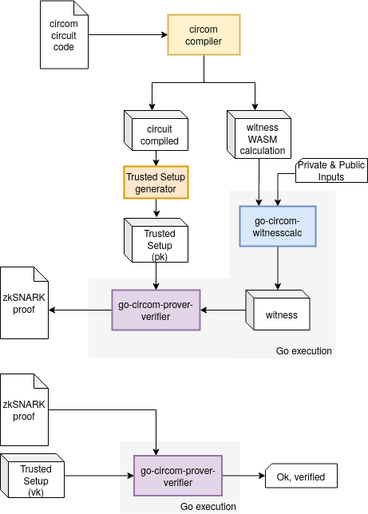

# go-zksnark-full-flow-example

zkSNARK full flow example in Go

- Compile the circuit using [circom](https://github.com/iden3/circom)
- Generate the trusted setup using [snarkjs](https://github.com/iden3/snarkjs)
- Calculate Witness from Go using [go-circom-witnesscalc](https://github.com/iden3/go-circom-witnesscalc)
- Generate zkProof from Go using [go-circom-prover-verifier](https://github.com/iden3/go-circom-prover-verifier)
- Verify zkProof from Go using [go-circom-prover-verifier](https://github.com/iden3/go-circom-prover-verifier)



## Usage

### Computer:
```
./complete-flow.sh
```
This will for each one of the circuits in the `testdata` directory:
1. compile the circuit
2. generate the trusted setup
3. calculate the witness
4. generate the zkProof
5. verify

### Android:
1. [Install Gomobile](https://github.com/golang/go/wiki/Mobile), you will need to install Android SDK and NDK.
2. Bind the Go code to Android: `mkdir -p Android/app/libs && gomobile bind --target android -o Android/app/libs/zkSNARK-full-flow.aar`
3. Connect a Android device or open an emulator and run: `cd Android && ./gradlew installDebug` this will compile and install the app.
4. Open logcat to see whats going on: `adb logcat GoLog:D \*:S -v long`
5. Launch the application on the device and tap to the "START FLOW" button. You should see the logs on the terminal of previous step.
